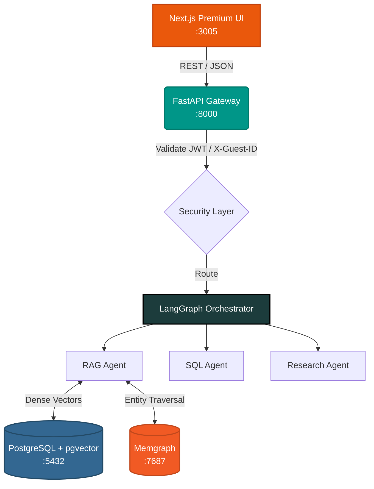

<div align="center">
  
  <h1>AgenticFlow Orchestrator</h1>
  <p><strong>Enterprise-Grade AI Service Mesh & Multi-Agent Orchestrator</strong></p>

  [](https://agenticflow.scholarme.in/)
  [](./docker-compose.yml)
  [](./backend/app/main.py)
  [](./backend/app/agents/graph.py)
  [](./nexus-frontend/)
</div>

<br/>

> **🌐 Live Production URL:** [https://agenticflow.scholarme.in/](https://agenticflow.scholarme.in/)

**AgenticFlow** is a highly scalable, fully containerized AI orchestrator that dynamically routes complex intents to specialized AI agents. Built entirely on a modern service mesh architecture, it securely isolates user data, maintains strict access control, and delivers state-of-the-art responses through **Hybrid Retrieval (Vector + Graph)**, Web Research, and dynamic SQL querying.

---

## 🚀 Key Innovations & Features

### 1. 🧠 Autonomous Multi-Agent Routing (LangGraph)
Unlike standard linear chatbots, AgenticFlow uses a sophisticated state machine built with **LangGraph**. User queries are automatically analyzed and routed to the most capable agent:
- **RAG Agent:** Ingests and synthesizes information from uploaded documents.
- **SQL Agent:** Analyzes requirements and dynamically generates valid SQL queries (without direct execution against production databases).
- **Research Agent:** Conducts live web research via Tavily API to fetch real-time data.
- **Code Agent:** Executes sandboxed Python code for complex mathematical or programmatic logic.

### 2. 🗄️ Hybrid Knowledge Engine (pgvector + Memgraph)
AgenticFlow implements a dual-database intelligence layer:
- **PostgreSQL (pgvector):** Handles semantic similarity search, dense vector embeddings, and persistent chat histories.
- **Memgraph (Knowledge Graphs):** Maps complex entity relationships, allowing the LLM to traverse highly connected data points that standard vector search misses.

### 3. 🔐 Enterprise Security & Data Isolation
Security is built into the foundation of the orchestrator, ensuring zero cross-tenant data leakage:
- **Strict User-Based Isolation:** Every document embedded, every SQL query executed, and every chat session is strictly partitioned by `user_id`. A user can *never* access another user's vector space.
- **JWT Authentication:** Cryptographically secure login and registration utilizing `bcrypt` hashing and HTTP Bearer tokens.
- **Guest Sandboxing:** Unauthenticated visitors receive a unique `X-Guest-ID`. Their sessions are aggressively rate-limited (e.g., 5 messages max) and completely isolated in memory before prompting for account creation.

### 4. 🎨 Premium Modern Frontend
The UI isn't just an afterthought—it's a massive competitive advantage:
- Built on **Next.js (React 18)** for blazing-fast SSR and hydration.
- Features a custom **Warm Charcoal & Sophisticated Orange** aesthetic with smooth glassmorphism, micro-animations, and dynamic gradients.
- **Thread-safe Execution:** The UI operates independently, communicating with the heavy LangGraph nodes purely via async REST APIs to prevent event-loop blocking.

---

## 🏗️ Architecture Mesh

The entire system runs as a multi-container Docker mesh, ensuring exact parity between local development and AWS production.



---

## 🐳 Production Deployment (AWS EC2)

The application is engineered for horizontal scaling and currently runs on a production AWS EC2 `t3.medium` instance. 
Traffic is securely reverse-proxied providing TLS termination and enterprise-ready network mapping, never exposing raw container ports to the public web.

**Docker Services Provisioned:**
1. `agenticflow-backend`: FastAPI + LangGraph worker
2. `agenticflow-frontend`: Next.js Standalone UI
3. `agenticflow-postgres`: PostgreSQL with `pgvector`
4. `agenticflow-memgraph`: High-performance Graph DB

---

## 🛠️ Local Development (Quickstart)

### Prerequisites
- [Docker](https://docs.docker.com/get-docker/) & Docker Compose v2+
- Google Gemini API Key

### 1. Clone & Setup
```bash
git clone https://github.com/Harsh-Sharma29/AgenticFlow.git
cd AgenticFlow
```

### 2. Environment Variables
Create a `.env` file in the project root:
```env
# ── Security ──────────────────────────────────────────────────────────
JWT_SECRET=super-secure-production-key-here

# ── AI Keys ───────────────────────────────────────────────────────────
GOOGLE_API_KEY=your-gemini-api-key
TAVILY_API_KEY=your-tavily-search-key

# ── System Defaults ────────────────────────────────────────────────────
PRIMARY_LLM_MODEL=gemini-2.5-flash
EMBEDDING_MODEL=gemini-embedding-001
DEBUG=false
```

### 3. Launch the Mesh
```bash
docker-compose up --build -d
```
The backend includes a dependency health-check; it waits for both Postgres and Memgraph to be fully ready before spinning up the API. Once the API is healthy, the frontend unlocks.

| Service | Container | Host Address & Port | Description |
|---------|-----------|---------------------|-------------|
| **Frontend UI** | `nexus-frontend` | [http://localhost:3005](http://localhost:3005) | Premium Next.js Web Interface |
| **Backend API** | `nexus-backend` | [http://localhost:8005/docs](http://localhost:8005/docs) | FastAPI Swagger & REST Endpoints |
| **PostgreSQL** | `nexus-postgres` | `localhost:5432` | Relational DB + `pgvector` index |
| **Memgraph** | `nexus-memgraph` | `localhost:7687` | Bolt protocol port for Knowledge Graph |
| **Memgraph Lab**| `nexus-memgraph` | `localhost:7444` | HTTP WebSocket port for Memgraph UI |

---

<p align="center">
  Built with ❤️ by <strong>Harsh Sharma</strong>
</p>
