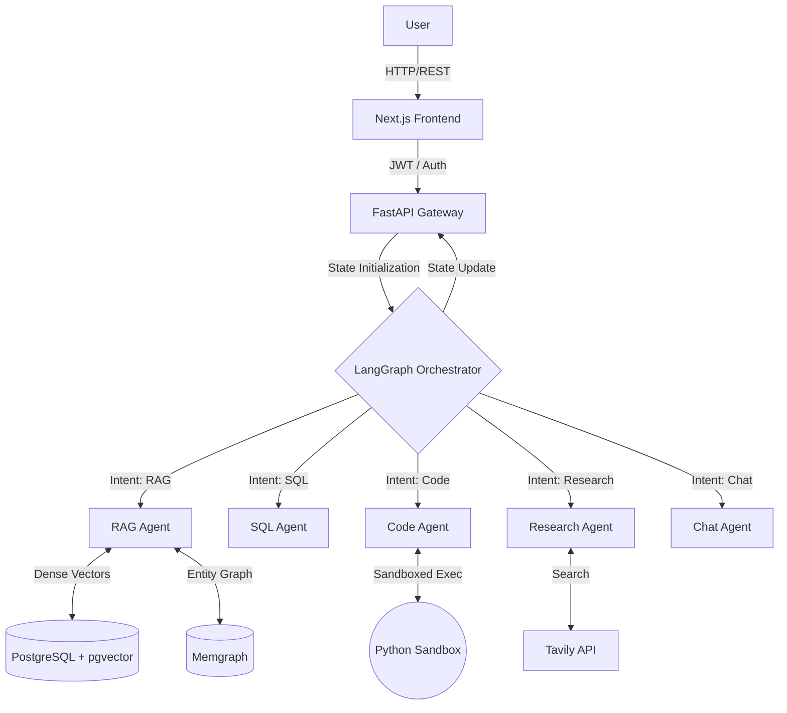

<div align="center">
  <h1>AgenticFlow</h1>
  <p><strong>Enterprise-Grade AI Service Mesh & Multi-Agent Orchestrator</strong></p>

  [](https://agenticflow.scholarme.in/)
  [](./docker-compose.yml)
  [](./backend/app/main.py)
  [](./backend/app/agents/graph.py)
  [](./nexus-frontend/)
</div>

<br/>

## 2. Demo / Links

- 🎥 **Watch Demo:** [Demo Video URL]
- 💻 **GitHub:** [https://github.com/Harsh-Sharma29/AgenticFlow](https://github.com/Harsh-Sharma29/AgenticFlow)
- 🌐 **Live Demo:** [https://agenticflow.scholarme.in/](https://agenticflow.scholarme.in/)
- 📄 **Portfolio:** [https://harsh-sharma-portfolio12.netlify.app](https://harsh-sharma-portfolio12.netlify.app)

## 3. Overview

**AgenticFlow** is a highly scalable, fully containerized AI orchestrator that dynamically routes complex intents to specialized AI agents. Built entirely on a modern service mesh architecture, it isolates user data, maintains access control, and delivers state-of-the-art responses through **Hybrid Retrieval (Vector + Graph)**, Web Research, and dynamic SQL querying.

The system utilizes an autonomous multi-agent state machine. User queries are analyzed and deterministic routing sends them to the most capable agent (RAG, SQL, Code, Research, or Chat), ensuring complex tasks are handled by dedicated pipelines rather than a single monolithic LLM prompt.

**Project-Specific Positioning:** AgenticFlow is an autonomous AI software engineering system. The core narrative flow for execution is: **Parse Intent → Route → Retrieve/Execute → Observe → Debug/Retry → Return**.

## 4. Key Engineering Highlights

- **Multi-Agent LangGraph Orchestration:** Replaces traditional linear chains with a stateful, cyclic graph capable of routing, fallback, and retry logic.
- **Hybrid Knowledge Engine:** Combines **PostgreSQL (pgvector)** for dense semantic search with **Memgraph** for graph-based entity relationship traversal.
- **Docker-Sandboxed Mesh:** Entire system runs as a multi-container Docker mesh (UI, Gateway, DBs) ensuring development-to-production parity.
- **Multi-Tenant Security:** Strict isolation using `user_id` and `workspace_id`. Sandboxed environments for unauthenticated "guests".
- **Dynamic Intent Routing:** Deterministically routes to SQL, Code, RAG, or Web Research agents based on structural prompt classification.
- **Asynchronous Execution:** FastAPI and LangGraph pipelines operate asynchronously (`ainvoke`) ensuring non-blocking execution under heavy loads.

## 5. Architecture



| Component | Responsibility |
|---|---|
| **Next.js Frontend** | Thread-safe, interactive UI with session management. |
| **FastAPI Gateway** | Auth validation, rate limiting, and HTTP handling. |
| **LangGraph Orchestrator** | State machine, intent routing, and agent coordination. |
| **PostgreSQL + pgvector** | Persistent chat history and dense vector embeddings. |
| **Memgraph** | Knowledge graph storage and complex entity traversal. |

## 6. How It Works

1. **User Request:** A user submits a prompt via the Next.js frontend alongside optional documents.
2. **Context Hydration:** FastAPI loads the `user_id` and persistent session history from PostgreSQL.
3. **Intent Classification:** LangGraph's entry node analyzes the query and strictly classifies it (e.g., `rag`, `sql`, `code`, `research`).
4. **Agent Routing:** The orchestrator transitions the state to the corresponding specialized agent node.
5. **Execution & Tools:** The agent executes its specific tools (e.g., querying pgvector/Memgraph, Tavily search, or sandboxed execution).
6. **Verification & Retry:** If an agent fails or output violates constraints, an `approval_gate` or `retry_handler` intercepts and adjusts.
7. **State Checkpoint:** The final output and context are saved to persistent memory.
8. **Response:** The completed state is returned asynchronously to the user.

## 7. Core Features

| Feature | Description | Implementation |
|---|---|---|
| **Deterministic Routing** | Queries are categorized before generation. | `classify_intent` LangGraph node with JSON parsing. |
| **Hybrid RAG** | Simultaneous semantic and relational search. | FAISS replaced by pgvector & Memgraph integration. |
| **Code Execution** | Executes programmatic logic safely. | Sandboxed Python environment via `code_agent`. |
| **Web Research** | Fetches live internet data. | Tavily API integration inside `research_agent`. |
| **Guest Sandboxing** | Isolated trial sessions for unauthenticated users. | `X-Guest-ID` tracking with rate-limiting. |

## 8. AI / Agent Architecture

- **Orchestration:** LangGraph state machine.
- **State Management:** `OrchestratorState` typed dictionary holding intents, errors, history, and LLM responses.
- **Agents:**
  - `rag_agent`: Synthesizes info from vectors and graphs.
  - `sql_agent`: Translates requests into valid SQL structures.
  - `code_agent`: Writes and executes data processing scripts.
  - `research_agent`: Triggers external APIs.
  - `chat_agent`: Handles generic conversational tasks.
- **Error Handling:** Built-in `graceful_fallback` and `retry_handler` nodes ensure the graph recovers from parsing errors or tool failures.

## 9. RAG / Knowledge System

- **Vector Storage:** PostgreSQL with `pgvector` extension.
- **Graph Storage:** Memgraph (accessed via Bolt protocol).
- **Process:**
  1. Documents uploaded are chunked and embedded.
  2. Vectors are stored in `pgvector`.
  3. Entities/Relationships are extracted and mapped in Memgraph.
  4. Retrieval runs concurrent queries against both databases.
  5. The `rag_agent` synthesizes the combined context into a grounded response.

## 10. Security

- **JWT Authentication:** Cryptographically secure endpoint protection.
- **Tenant Isolation:** All data access is strictly filtered by `user_id` and `workspace_id`. Users cannot query vectors outside their namespace.
- **Sandboxing:** Code execution runs in an isolated scope.
- **Input Validation:** Strict Pydantic schemas enforce payload integrity on the API layer.

## 11. Tech Stack

| Category | Technologies |
|---|---|
| **Language** | Python 3.10+, TypeScript |
| **AI / Orchestration** | LangGraph, LangChain, Google Gemini API |
| **Backend** | FastAPI, Pydantic |
| **Frontend** | Next.js (React 18) |
| **Databases** | PostgreSQL, Memgraph |
| **Vector Engine** | pgvector |
| **Infrastructure** | Docker, Docker Compose, AWS EC2 |
| **External APIs** | Tavily Search |

## 12. Project Structure

```text
AgenticFlow/
├── backend/
│   ├── app/
│   │   ├── agents/      # LangGraph nodes and state definitions
│   │   ├── api/         # FastAPI endpoints and dependencies
│   │   ├── services/    # External service connectors (RAG, LLM)
│   │   ├── utils/       # Helpers and parsers
│   │   ├── config.py    # Environment parsing
│   │   └── main.py      # FastAPI application entrypoint
│   ├── Dockerfile
│   └── requirements.txt
├── nexus-frontend/      # Next.js web interface
├── workspaces/          # Local persistent volume mounts
├── docker-compose.yml   # Multi-container orchestration mesh
├── nginx.conf           # Reverse proxy configuration
└── README.md
```

## 13. Local Setup

**Prerequisites:**
- Docker & Docker Compose v2+
- Google Gemini API Key
- Tavily API Key

1. **Clone the repository:**
   ```bash
   git clone https://github.com/Harsh-Sharma29/AgenticFlow.git
   cd AgenticFlow
   ```
2. **Configure Environment:**
   Create a `.env` file in the root directory. (See Environment Variables below).
3. **Launch the Mesh:**
   ```bash
   docker-compose up --build -d
   ```
4. **Access the Services:**
   - Frontend UI: `http://localhost:3005`
   - Backend API Docs: `http://localhost:8005/docs`
   - Memgraph Lab: `http://localhost:7444`

## 14. Environment Variables

| Variable | Purpose | Required |
|---|---|---|
| `JWT_SECRET` | Secret key for JWT token generation | Yes |
| `GOOGLE_API_KEY` | Authentication for Gemini LLM models | Yes |
| `TAVILY_API_KEY` | Authentication for Web Research | Yes |
| `PRIMARY_LLM_MODEL` | Default LLM (e.g., `gemini-2.5-flash`) | No |
| `EMBEDDING_MODEL` | Default Embedding model | No |
| `DEBUG` | Enable verbose logging | No |

## 15. API / Service Endpoints

| Method | Endpoint | Purpose |
|---|---|---|
| `POST` | `/api/chat` | Main conversational orchestrator endpoint |
| `GET` | `/api/health` | Liveness and readiness probe |
| `GET` | `/api/sessions` | List active chat sessions for the user |
| `GET` | `/api/sessions/{id}` | Load specific chat history |
| `PUT` | `/api/sessions/{id}` | Rename a chat session |
| `DELETE` | `/api/sessions/{id}` | Delete a chat session |

## 16. Screenshots

<!-- Add screenshot of Main Dashboard here -->
<!-- Add screenshot of Chat Interface here -->
<!-- Add screenshot of Knowledge Graph visualization here -->

## 17. Demo

🎥 **Demo**
▶ [Watch the Demo](YOUR_DEMO_URL)
*Watch AgenticFlow autonomously route a complex query to the appropriate agent, perform semantic search, and stream the response.*

## 18. Engineering Decisions

- **Why LangGraph:** Chose graph-based orchestration over linear chains (like standard LangChain agents) to support cycles, dynamic retries, and deterministic state transitions.
- **Why pgvector + Memgraph:** Standard vector search loses semantic relationships between disconnected documents. Combining dense embeddings (pgvector) with explicit entity mappings (Memgraph) significantly improves context retrieval.
- **Why FastAPI:** Python's leading async framework allows for non-blocking `ainvoke` calls to LLMs, efficiently handling concurrent user requests.
- **Why Docker Service Mesh:** Ensures absolute parity between local development and AWS EC2 production, abstracting away dependency conflicts.

## 19. Reliability / Error Handling

- **Fallback Nodes:** Graph contains a `graceful_fallback` node to catch unhandled exceptions without crashing the user session.
- **Retry Logic:** LLM parsing errors (e.g., bad JSON from intent classifier) trigger a `retry_handler` that re-prompts the model with the traceback.
- **Validation:** Pydantic models strictly validate incoming API payloads.
- **State Recovery:** The orchestrator checkpoints state at every step using `MemorySaver`, allowing resumption of failed threads.

## 20. Current Status

- **Status:** Actively developed and deployed to production.
- **Live Deployment:** Running on AWS EC2 behind an NGINX reverse proxy.
- **Implemented:** Full LangGraph workflow, pgvector, Memgraph, Next.js UI, JWT Auth.

## 21. Limitations

- Web Research is dependent on Tavily API rate limits.
- Code execution is currently sandboxed via process isolation, not full gVisor/firecracker microVMs.
- Heavy reliance on Google's Gemini models; migrating to local models requires prompt tuning.

## 22. Future Improvements

- [ ] Implement user-configurable agent weights.
- [ ] Add Firecracker microVMs for absolute code execution security.
- [ ] Support multi-modal inputs (images, audio) natively in the Next.js UI.
- [ ] Integrate with external GitHub repositories for direct codebase analysis.

## 23. Author

**Harsh Sharma**
- GitHub: [https://github.com/Harsh-Sharma29](https://github.com/Harsh-Sharma29)
- LinkedIn: [https://www.linkedin.com/in/harsh-sharma029](https://www.linkedin.com/in/harsh-sharma029)
- Portfolio: [https://harsh-sharma-portfolio12.netlify.app](https://harsh-sharma-portfolio12.netlify.app)
