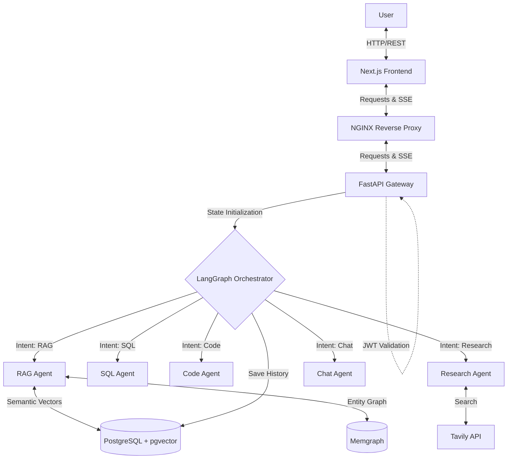

<div align="center">
  <h1>AgenticFlow | Multi-Agent AI Service Mesh</h1>
  <p><strong>A stateful multi-agent AI orchestration platform that routes complex user intents across specialized RAG, SQL, Web Research, Code Execution, and conversational workflows.</strong></p>
</div>

<br/>

## 🎥 Demo & Links

- 🎥 [▶ Watch Demo](YOUR_DEMO_URL)
- 💻 **GitHub:** [https://github.com/Harsh-Sharma29/AgenticFlow](https://github.com/Harsh-Sharma29/AgenticFlow)
- 🌐 **Live Demo:** [https://agenticflow.scholarme.in/](https://agenticflow.scholarme.in/)
- 📄 **Portfolio:** [https://harsh-sharma-portfolio12.netlify.app](https://harsh-sharma-portfolio12.netlify.app)

## Overview

**AgenticFlow** is a multi-agent AI orchestration platform that dynamically routes user requests to specialized AI workflows. Rather than relying on a single monolithic LLM prompt, it uses a graph-based state machine to classify intent and delegate tasks to dedicated agents for Retrieval-Augmented Generation (RAG), SQL generation, code execution, web research, and general chat.

The platform handles complex requests by maintaining a persistent conversational state and execution context. This allows it to seamlessly integrate dense semantic search and relationship-aware graph traversal, ensuring grounded and context-aware responses.

## Key Engineering Highlights

- **Stateful LangGraph Orchestration:** Replaces traditional linear chains with a cyclic graph capable of routing, fallback, and retry logic, using `MemorySaver` for in-memory graph state.
- **Deterministic Intent Routing:** Queries are classified via LLM and strictly routed to specialized agents (`rag`, `sql`, `code`, `research`, `chat`).
- **Hybrid RAG Engine:** Combines **PostgreSQL (pgvector)** for dense semantic search with **Memgraph** for graph-based entity relationship traversal.
- **Asynchronous Execution:** Built on FastAPI supporting asynchronous `ainvoke` calls and Server-Sent Events (SSE) streaming.
- **Multi-Tenant Isolation:** Maintains strict data boundaries using `user_id` and `workspace_id`, along with isolated guest sessions.
- **Dockerized Service Mesh:** The multi-container Docker mesh (Next.js, FastAPI, PostgreSQL, Memgraph, NGINX) helps maintain consistent environments across development and deployment.

## Architecture



| Component | Responsibility |
|---|---|
| **Next.js Frontend** | Interactive UI with session management and SSE streaming. |
| **FastAPI Gateway** | Auth validation, document upload handling, and async endpoint serving. |
| **LangGraph Orchestrator** | State machine, deterministic intent routing, and agent coordination. |
| **PostgreSQL + pgvector** | Custom persistent storage for chat history, workspaces, and dense vector embeddings. |
| **Memgraph** | Knowledge graph storage for complex entity relationship traversal. |
| **NGINX** | Reverse proxy handling traffic routing to frontend and backend services. |

## How It Works

1. **User Request:** A user submits a prompt via the Next.js frontend, optionally alongside new documents.
2. **Context Hydration:** FastAPI loads the `user_id`, `workspace_id`, and persistent session history from PostgreSQL.
3. **Intent Classification:** LangGraph's entry node analyzes the query and classifies it (e.g., `rag`, `sql`, `code`, `research`, `chat`).
4. **Agent Routing:** The orchestrator transitions the state to the corresponding specialized agent node based on the classified intent.
5. **Execution & Tools:** The selected agent executes its specific workflow (e.g., querying pgvector/Memgraph, Tavily search, or executing sandboxed code).
6. **State Verification:** If an agent encounters an error or requires approval, the graph routes to a `retry_handler` or `approval_gate` node.
7. **State Checkpoint:** The final output and context are saved to persistent memory.
8. **Response:** The completed state is returned or streamed via Server-Sent Events (SSE) back to the user.

## Core Features

| Feature | Description | Implementation |
|---|---|---|
| **Deterministic Routing** | Queries are categorized before generation. | `classify_intent` LangGraph node with JSON parsing. |
| **Multi-Agent Orchestration** | Dedicated agents for specific problem domains. | `rag_agent`, `sql_agent`, `code_agent`, `research_agent`. |
| **Hybrid RAG** | Simultaneous semantic and relational search. | PGVector & Memgraph integration via `rag_service`. |
| **Web Research** | Fetches live internet data for current events. | Tavily API integration inside `research_agent`. |
| **Guest Isolation** | Isolated sessions for unauthenticated users. | `user_id="guest"` logic applied at API level. |
| **Persistent State** | Continuous conversations across sessions. | LangGraph `MemorySaver` (in-memory) and PostgreSQL (long-term history). |

## AI / Agent Architecture

### Orchestration
The system uses LangGraph to construct a state machine. It moves away from simple prompt-chaining to a cyclical, directed graph that supports state modification and dynamic routing.

### State
The `OrchestratorState` is a typed dictionary containing the conversation intent, errors, message history, retrieved context, and execution status. It ensures every node shares a standardized data contract.

### Routing
The `classify_intent` node evaluates the user's prompt (along with workspace context) to deterministically output a JSON classification. This classification drives conditional edges in the graph to route to the correct agent.

### Agents
- **`rag_agent`**: Synthesizes answers based on context retrieved dynamically from both vector and graph databases.
- **`sql_agent`**: Translates natural language requests into valid SQL structures based on provided schema assumptions.
- **`code_agent`**: Generates and executes isolated Python code to process data or perform computational tasks.
- **`research_agent`**: Uses the Tavily API to fetch current web information before synthesizing a response.
- **`chat_agent`**: Handles general knowledge questions, greetings, and conversational tasks without external tool dependencies.

### Error Handling
The graph implements a `retry_handler` for unexpected failures and a `graceful_fallback` node to catch unhandled exceptions, ensuring the system can recover gracefully without breaking the user session.

## RAG / Knowledge System

The retrieval pipeline uses a Hybrid GraphRAG approach to combine semantic meaning and structural relationships.

1. **Document Ingestion:** Uploaded files (PDFs, TXT, MD) are processed and chunked.
2. **Embedding Generation:** Text chunks are passed through a local HuggingFace embedding model (`BAAI/bge-small-en-v1.5`).
3. **Vector Storage:** Dense vectors are stored in PostgreSQL via the `pgvector` extension.
4. **Graph Extraction:** In parallel, entities and relationships are extracted from chunks and stored in Memgraph.
5. **Semantic Retrieval:** User queries run similarity searches against PGVector for semantic matches.
6. **Graph Traversal:** The query is also executed against Memgraph to retrieve related entity networks.
7. **Combined Context:** Both vector and graph results are combined into a comprehensive context block.
8. **Final Generation:** The `rag_agent` synthesizes the combined context into a grounded response.

## Security

- **JWT Authentication:** Endpoint protection via JSON Web Tokens for user sessions.
- **Workspace Isolation:** All data access (documents, vectors, chat history) is strictly filtered by `user_id` and `workspace_id`.
- **Guest Isolation:** Unauthenticated requests default to an isolated "guest" session to trial the system safely.
- **Input Validation:** Strict Pydantic schemas enforce payload integrity and type safety at the API layer.

## Tech Stack

| Category | Technologies |
|---|---|
| **Language** | Python 3.10+, TypeScript |
| **AI / Orchestration** | LangGraph, LangChain, Gemini API, HuggingFace |
| **Backend** | FastAPI, Pydantic |
| **Frontend** | Next.js (React 18) |
| **Databases** | PostgreSQL, Memgraph |
| **Vector Search** | pgvector |
| **Infrastructure** | Docker, Docker Compose, NGINX |
| **External APIs** | Tavily Search |

## Project Structure

```text
AgenticFlow/
├── backend/
│   ├── app/
│   │   ├── agents/      # LangGraph state machine, nodes, and routing logic
│   │   ├── api/         # FastAPI endpoints (chat, upload, auth)
│   │   ├── services/    # External integrations (RAG, Memgraph, Storage)
│   │   ├── utils/       # Helpers and intent parsers
│   │   ├── config.py    # Pydantic environment configuration
│   │   └── main.py      # FastAPI application entrypoint
│   ├── Dockerfile
│   └── requirements.txt
├── nexus-frontend/      # Next.js web interface
├── workspaces/          # Local persistent volume mounts for uploaded files
├── docker-compose.yml   # Multi-container orchestration mesh
├── nginx.conf           # Reverse proxy configuration
└── README.md
```

## Local Setup

### Prerequisites
- Docker & Docker Compose v2+
- Google Gemini API Key
- Tavily API Key

### Clone
```bash
git clone https://github.com/Harsh-Sharma29/AgenticFlow.git
cd AgenticFlow
```

### Environment Configuration
Create a `.env` file in the root directory and populate the required API keys.
```env
GOOGLE_API_KEY=your_gemini_key
TAVILY_API_KEY=your_tavily_key
POSTGRES_PASSWORD=your_secure_password
```

### Build and Run
```bash
docker compose up --build -d
```

### Verify
- Frontend UI: `http://localhost:3000` (or `http://localhost:80` via NGINX)
- Backend API Docs: `http://localhost:8005/docs`

## Environment Variables

| Variable | Purpose | Required |
|---|---|---|
| `GOOGLE_API_KEY` | Authentication for Gemini LLM models | Yes |
| `TAVILY_API_KEY` | Authentication for Web Research | Yes |
| `POSTGRES_PASSWORD` | Password for PostgreSQL database initialization | Yes |
| `JWT_SECRET` | Secret key for JWT token generation | No (defaults provided) |
| `PRIMARY_LLM_MODEL` | Default LLM (e.g., `gemini-2.5-flash`) | No |
| `EMBEDDING_MODEL` | Default Embedding model | No |

## API / Service Endpoints

| Method | Endpoint | Purpose |
|---|---|---|
| `POST` | `/api/chat` | Main conversational endpoint (async LangGraph execution) |
| `POST` | `/api/chat/stream` | Server-Sent Events (SSE) streaming endpoint |
| `POST` | `/api/upload` | Document upload and indexing endpoint |
| `GET` | `/api/health` | Liveness and readiness probe |
| `GET` | `/api/sessions` | List active chat sessions for the authenticated user |
| `GET` | `/api/sessions/{session_id}`| Load specific chat history |
| `DELETE`| `/api/sessions/{session_id}`| Delete a chat session |

## 📸 Screenshots

<!-- Add dashboard screenshot -->
<!-- Add agent execution screenshot -->
<!-- Add RAG result screenshot -->
<!-- Add knowledge graph screenshot -->
<!-- Add SQL/code/research workflow screenshot -->


## Engineering Decisions

### Why LangGraph?
Graph-based orchestration was chosen over linear chains (like standard LangChain agents) to natively support cyclical execution, dynamic retries, conditional routing, and deterministic state transitions.

### Why FastAPI?
FastAPI's asynchronous architecture allows for non-blocking `ainvoke` calls to LLMs and efficient integration with Server-Sent Events (SSE) for streaming responses, handling concurrent user requests effectively.

### Why pgvector?
Using PostgreSQL with `pgvector` enables dense semantic similarity search directly within a robust relational database, simplifying infrastructure while providing high-performance retrieval.

### Why Memgraph?
Memgraph provides high-performance, in-memory graph traversal. This allows the system to extract and query explicit entities and relationships, which standard vector search often misses.

### Why both vector + graph?
Standard vector search can lose semantic relationships between disconnected documents. Combining dense embeddings (pgvector) with explicit entity mappings (Memgraph) provides complementary semantic and structural retrieval signals, locating both semantically similar text and structurally related facts.

### Why Docker?
The multi-container Docker mesh helps maintain consistent environments across development and deployment, isolating services and abstracting away dependency conflicts.

## Reliability / Error Handling

- **Fallback Nodes:** The graph contains a `graceful_fallback` node to catch unhandled exceptions without crashing the user session.
- **Retry Logic:** LLM parsing errors trigger a `retry_handler` node that re-prompts the model, improving robustness.
- **State Checkpointing:** The orchestrator maintains in-memory state using LangGraph's `MemorySaver`, while long-term conversation history and documents are persisted in PostgreSQL.
- **Validation:** Strict Pydantic models validate incoming API payloads at the FastAPI layer.

## Current Status

- Actively developed and maintained.
- Implemented core features include full LangGraph workflows, pgvector/Memgraph integration, Next.js UI, and JWT Auth.

## Limitations

- Web Research capabilities are strictly dependent on external Tavily API rate limits.
- Code execution is currently run directly in the host process using Python `exec()`, which lacks secure isolation compared to full Firecracker microVMs.
- Heavy reliance on external LLM providers (Gemini) requires prompt retuning if migrating to local models.

## Future Improvements

- [ ] Implement Firecracker microVMs or gVisor for stronger code-execution isolation.
- [ ] Add user-configurable agent weights and model selection from the UI.
- [ ] Support multi-modal inputs (images, audio) natively in the Next.js frontend.
- [ ] Integrate with external GitHub repositories for direct codebase analysis.

## Author

**Harsh Sharma**

- GitHub: [https://github.com/Harsh-Sharma29](https://github.com/Harsh-Sharma29)
- LinkedIn: [https://www.linkedin.com/in/harsh-sharma029](https://www.linkedin.com/in/harsh-sharma029)
- Portfolio: [https://harsh-sharma-portfolio12.netlify.app](https://harsh-sharma-portfolio12.netlify.app)
